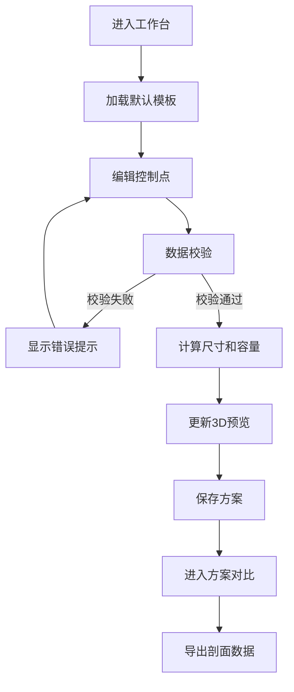

## 1. 产品概述
陶瓷剖面绘制与器型估算系统，为陶瓷研究人员提供直观的器物剖面曲线绘制工具，通过数字化方式记录、分析和对比古代陶瓷器型特征。
- 目标用户：考古研究人员、陶瓷修复专家、文物研究机构
- 核心价值：将传统手工测量方式数字化，提供精确的尺寸估算和容量计算，支持多方案对比研究

## 2. 核心功能

### 2.1 功能模块
1. **剖面绘制工作台**：控制点编辑、曲线绘制、自交检测、底部闭合检查
2. **器型预览模块**：2D剖面旋转生成3D器型可视化、实时更新
3. **尺寸估算模块**：口径、腹径、底径、高度自动计算、容量估算
4. **方案管理模块**：方案保存、多方案对比视图
5. **修坯标记模块**：在剖面曲线上标记修坯位置
6. **数据导出模块**：导出JSON格式剖面数据，保留控制点顺序和单位

### 2.2 页面详情
| 页面名称 | 模块名称 | 功能描述 |
|-----------|-------------|---------------------|
| 工作台主页 | 左侧工具栏 | 添加控制点、删除控制点、重置曲线、保存方案 |
| 工作台主页 | 中心绘制区 | Canvas画布绘制剖面、拖拽编辑控制点 |
| 工作台主页 | 右侧信息面板 | 尺寸显示、容量估算、单位设置、数据校验提示 |
| 工作台主页 | 3D预览区 | 器型3D旋转预览、光照效果、可交互旋转 |
| 方案对比页 | 方案列表 | 已保存方案卡片展示、选择对比 |
| 方案对比页 | 对比视图 | 多个器型剖面叠加对比、尺寸差异标注 |

## 3. 核心流程
用户进入工作台后，默认加载一个基础器型模板。通过在画布上添加或拖拽控制点调整剖面曲线，系统实时校验控制点数量（≥3）、曲线自交、底部闭合状态。校验通过后自动计算尺寸和容量，并在3D预览区显示旋转器型。用户可保存当前方案，进入对比页面查看多个方案的剖面叠加对比。最后可导出包含控制点顺序和单位的JSON数据文件。

## 4. 用户界面设计

### 4.1 设计风格
- **主色调**：青瓷釉色（#5D8A66）作为主题色，配合陶土棕（#8B6914）辅助色
- **背景色**：米白宣纸色（#F5F0E8），营造文物研究的典雅氛围
- **按钮风格**：圆角矩形、扁平设计、hover状态颜色加深
- **字体**：标题使用思源宋体（典雅学术感），正文使用思源黑体（清晰易读）
- **布局风格**：三栏式布局（左工具栏-中画布-右信息面板），顶栏显示项目标题
- **图标风格**：线性图标，使用Lucide图标库

### 4.2 页面设计概述
| 页面名称 | 模块名称 | UI元素 |
|-----------|-------------|-------------|
| 工作台主页 | 左侧工具栏 | 垂直排列工具按钮、图标+文字、分组边框 |
| 工作台主页 | 中心绘制区 | 网格背景画布、控制点（可拖拽圆点）、曲线（平滑贝塞尔）、坐标轴刻度 |
| 工作台主页 | 右侧信息面板 | 卡片式分组、尺寸数据大号数字显示、容量结果突出显示、校验状态徽章 |
| 工作台主页 | 3D预览区 | 器型渲染区域、旋转控制条、光照模式切换 |
| 方案对比页 | 方案列表 | 卡片网格、缩略图预览、选择复选框 |
| 方案对比页 | 对比视图 | 叠加剖面曲线（不同颜色）、图例说明、尺寸对比表格 |

### 4.3 响应式
- Desktop优先设计，最小支持1280px宽度
- 画布区域自适应剩余空间
- 信息面板固定宽度320px
- 工具栏固定宽度80px

### 4.4 3D场景指导
- **环境**：柔光棚效果，模拟博物馆展柜照明
- **光照设置**：主光源+两盏补光灯，突出器型轮廓和曲线转折
- **相机设置**：初始45°俯视角度，可绕Y轴旋转，支持滚轮缩放
- **材质**：陶瓷质感，轻微反射，半透明釉面效果
- **交互**：拖拽旋转查看器型全貌，双击重置视角
