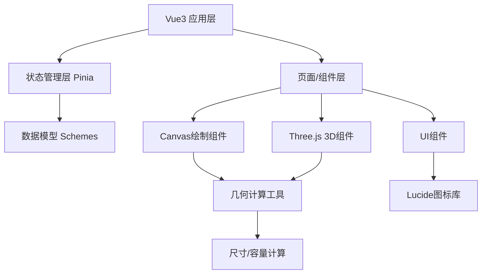
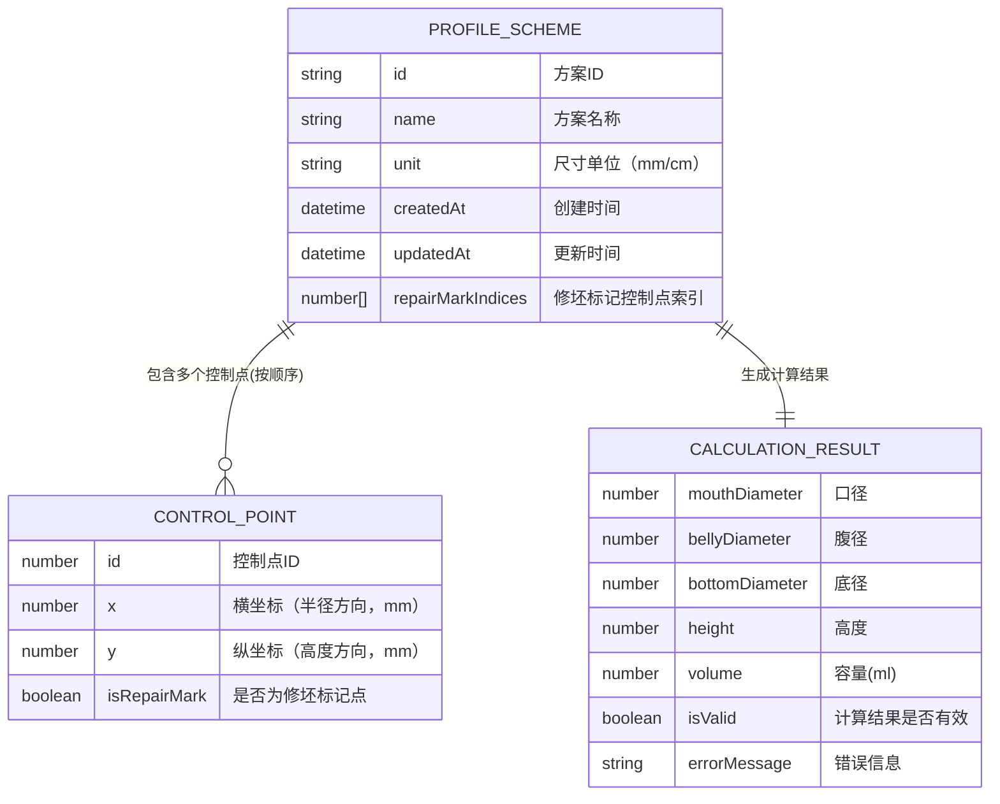

## 1. 架构设计
本项目为纯前端应用，采用Vue3 + TypeScript构建，使用Canvas进行2D剖面绘制，使用Three.js进行3D器型渲染。所有数据存储在前端本地（localStorage），支持导出JSON文件。



## 2. 技术描述
- **前端框架**：Vue@3.4 + TypeScript@5.4 + Vite@5.2
- **CSS框架**：Tailwind CSS@3.4
- **状态管理**：Pinia@2.1
- **3D渲染**：Three.js@0.162 + @types/three
- **图标库**：Lucide Vue@0.344
- **路由**：Vue Router@4.3
- **数据持久化**：localStorage
- **包管理器**：npm

## 3. 路由定义
| 路由 | 用途 |
|-------|---------|
| / | 工作台主页（剖面绘制+3D预览+信息面板） |
| /compare | 方案对比页面 |

## 4. 数据模型

### 4.1 数据模型定义



### 4.2 TypeScript 类型定义

```typescript
// 控制点
interface ControlPoint {
  id: number;
  x: number;  // 半径方向，必须 >= 0
  y: number;  // 高度方向，必须 >= 0
}

// 修坯标记
interface RepairMark {
  pointIndex: number;  // 关联的控制点索引
  description?: string;
}

// 剖面方案
interface ProfileScheme {
  id: string;
  name: string;
  unit: 'mm' | 'cm';
  controlPoints: ControlPoint[];
  repairMarks: RepairMark[];
  createdAt: number;
  updatedAt: number;
}

// 计算结果
interface CalculationResult {
  mouthDiameter: number;      // 口径 (最上沿直径)
  bellyDiameter: number;      // 腹径 (最大直径)
  bottomDiameter: number;     // 底径 (最下沿直径)
  height: number;             // 高度
  volume: number | null;      // 容量 ml (底部不闭合时为null)
  isValid: boolean;
  errors: string[];
}

// 校验结果
interface ValidationResult {
  isValid: boolean;
  errors: string[];
  warnings: string[];
}
```

## 5. 核心算法

### 5.1 剖面曲线绘制
- 使用三次贝塞尔曲线(Catmull-Rom spline转换)连接控制点
- 控制点顺序：从底部到顶部，沿右侧轮廓绘制

### 5.2 曲线自交检测
- 将曲线离散化为线段集合
- 检查任意两条非相邻线段是否相交

### 5.3 底部闭合检测
- 检查第一个控制点（底部）x坐标 > 0 且 最后一个控制点（顶部）x坐标 > 0
- 曲线需形成从口沿到底部的完整轮廓

### 5.4 容量计算（旋转体体积）
- 使用圆盘法（Disk Method）：V = π ∫ [r(y)]² dy
- 将剖面曲线沿Y轴旋转，离散化积分
- 单位转换：mm³ → ml（1ml = 1000mm³）

### 5.5 3D旋转体生成
- 使用LatheGeometry将2D剖面旋转生成网格
- 细分段数：径向32段，高度方向与控仯点密度匹配
